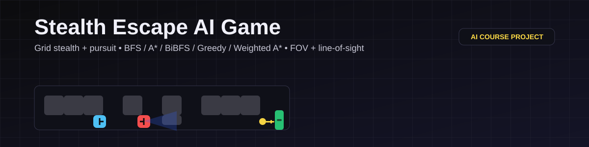

# Stealth Escape AI Game (University AI Assignment)


A grid-based stealth / escape-room game built with **pygame** where you must collect all **Keys (K)** to unlock the **Exit (E)** while AI guards patrol, detect you via field-of-view + line-of-sight, and chase using classic search algorithms.

This project was developed and submitted as a **university assignment** for an **Artificial Intelligence** course.

## AI Concepts Used

- **State machines (FSM)** for guard behavior: `PATROL → DETECTION → CHASE → MEMORY → PATROL`
- **Pathfinding & graph search** on a 4-neighbor grid
- **Heuristics** (Manhattan distance) for informed search
- **Agent perception**: cone-based field-of-view + **line-of-sight** occlusion
- **Pursuit / interception heuristic**: predicting likely player routes toward keys/exit and choosing intercept targets

## Algorithms Implemented

Implemented from scratch in Python (no pathfinding libraries):

- **BFS** (Breadth-First Search)
- **Bidirectional BFS** (BiBFS)
- **A\*** with Manhattan heuristic
- **Weighted A\*** (WA\*) where $f = g + w \cdot h$
- **Greedy Best-First Search**
- **Bresenham line algorithm** (grid line tracing) for line-of-sight checks

## Features

- Multiple tile maps with metadata-driven guard patrol paths (see `assets/maps/*_meta.json`)
- Difficulty settings (Easy / Medium / Hard) that affect guard count, vision, speed, and interception
- In-game menu for selecting map, difficulty, algorithm, guard speed, and debug mode
- Optional debug output that prints AI decisions and search statistics to the console

## Technologies

- **Language:** Python
- **Library:** pygame
- **Assets:** plain-text grid maps (`.txt`) + JSON metadata (`.json`)
- **Platform:** Windows-friendly launcher (`Run_Stealth_Escape_AI_Game.bat`)

## Installation

### Clone

```bash
git clone https://github.com/<your-username>/stealth-escape-ai-game.git
cd stealth-escape-ai-game
```

### Prerequisites

- Python **3.10+** (Python 3.10/3.11 recommended for easiest pygame install on Windows)

### Windows (PowerShell)

```powershell
python -m venv .venv
.\.venv\Scripts\pip install -r requirements.txt
```

## Usage

### Run (recommended)

- Double-click `Run_Stealth_Escape_AI_Game.bat`.
- On first run it creates `.venv` (Python 3.11) and installs dependencies.

### Run from terminal

```powershell
.\.venv\Scripts\python -m stealth_escape_ai_game
```

### CLI options

```powershell
.\.venv\Scripts\python -m stealth_escape_ai_game --map map1 --difficulty 2
.\.venv\Scripts\python -m stealth_escape_ai_game --debug
```

## Controls

### Menu

- `UP / DOWN` : Select map
- `LEFT / RIGHT` : Change difficulty
- `A / D` : Change pathfinding algorithm
- `Q / E` : Change guard speed multiplier
- `F1` : Toggle debug mode (prints AI reasoning to console)
- `ENTER` : Start
- `ESC` : Quit

### In-Game

- `W A S D` : Move one tile
- `ESC` : Quit

## Map Legend

- `#` wall
- `.` empty floor
- `P` player spawn
- `G` guard spawn
- `E` exit
- `K` key

## Project Structure

```text
.
├── README.md
├── requirements.txt
├── Run_Stealth_Escape_AI_Game.bat
├── assets/
│   └── maps/
│       ├── map1.txt
│       ├── map1_meta.json
│       ├── map2.txt
│       ├── map2_meta.json
│       ├── map3.txt
│       ├── map3_meta.json
│       ├── map4.txt
│       └── map4_meta.json
└── stealth_escape_ai_game/
    ├── __init__.py
    ├── __main__.py
    ├── config.py
    ├── entities.py
    ├── game.py
    ├── grid.py
    ├── main.py
    ├── rendering.py
    └── ai/
        ├── __init__.py
        ├── pathfinding.py
        └── vision.py
```

## License

MIT License. See `LICENSE`.

## Author

- Name: (add your name)
- Course: Artificial Intelligence (University Assignment)

